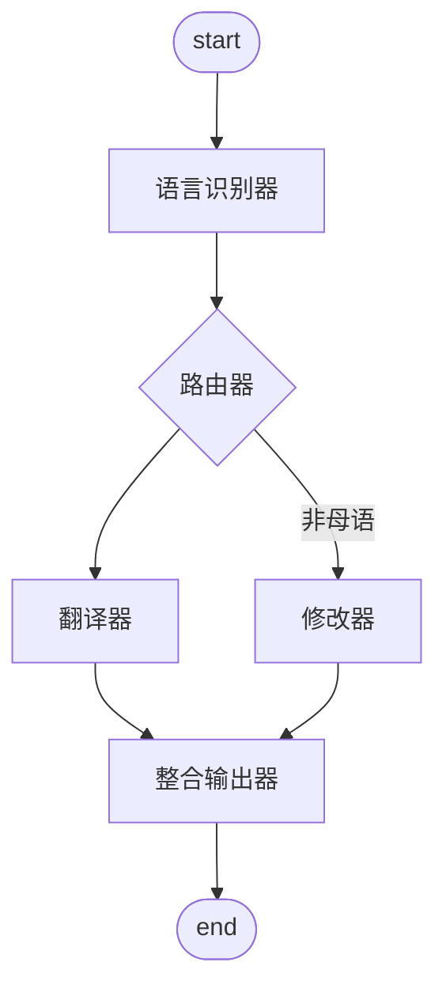

## 需求

- 输入中文，提供英文和德文的翻译
- 输入英文，提供中文，用于参考是不是自己想表达的意思，以及地道改写的英文版本，用于正式回复
- 输入德文，提供中文，用于参考是不是自己想表达的意思，以及地道改写的德文版本，用于正式回复
- 改写版本的语法和用词服务当地的习惯，友好，传递信息，并且不会有歧义

## 设计

state
- 原始段落
- 输入语言
- 翻译后段落
- 改写后段落

config
- 输出语言 list
- 确认语言 literal

