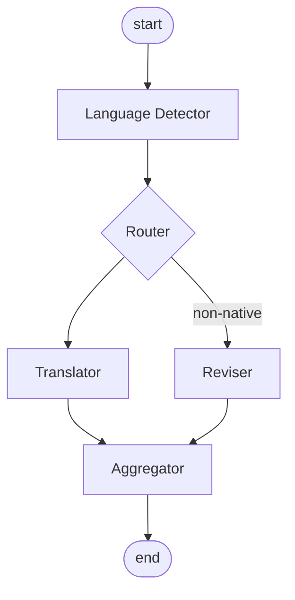

## Requirements

- Input Chinese → provide English and German translations
- Input English → provide Chinese (to check the meaning matches intent) and an idiomatic English rewrite for formal replies
- Input German → provide Chinese (to check the meaning matches intent) and an idiomatic German rewrite for formal replies
- The rewritten version's grammar and wording should fit local conventions, be friendly, convey the meaning clearly, and be unambiguous

## Design

state
- raw paragraph
- input language
- translated paragraph
- revised paragraph

config
- output languages (list)
- confirmed language (literal, single value)

## Notes / Gotchas

- **LangGraph silently drops state keys that aren't declared in the state schema.** If a node's return dict contains a key not present in the `TypedDict` passed to `StateGraph(...)`, LangGraph merges it in silently — no error, no warning — and it just doesn't show up in the final result. Verified with a minimal repro: a node returning `{"not_in_schema": "surprise"}` against a schema without that field simply vanishes from `compiled.invoke(...)`'s output.
  - Lesson: never build the final result by spreading an inner dict's keys (e.g. `output.update(some_dict)`) directly into a node's top-level return — those keys must already be declared fields on the state schema, or they get eaten. Give the aggregated result its own explicit field (e.g. `final_output: dict[str, str]`) instead of flattening into ad-hoc top-level keys.
